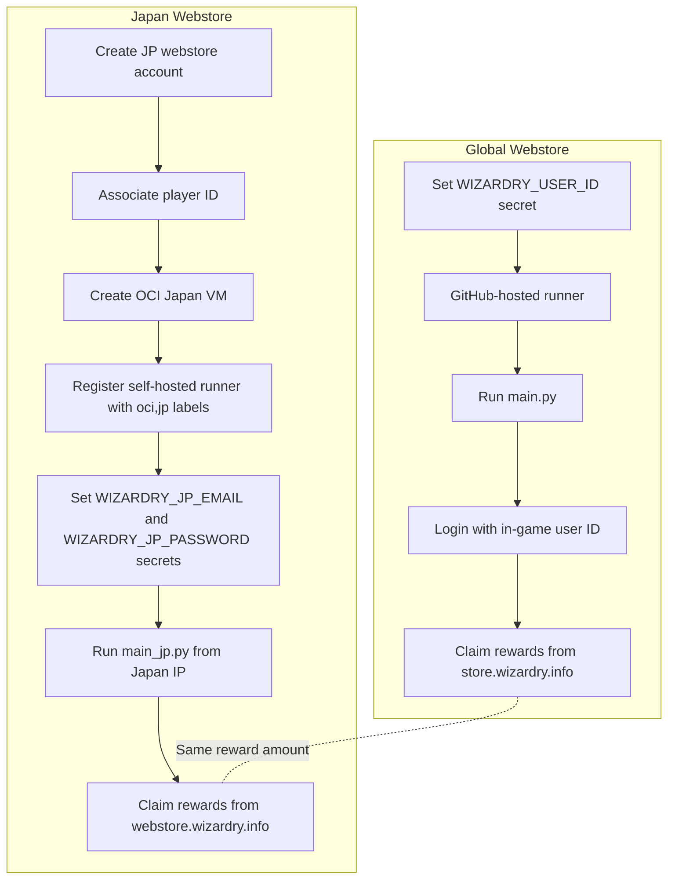

# Wizardry Variants Daphne Store Autocollector

[English | [繁體中文](README.zh-TW.md)]

This repository collects free rewards from the Wizardry Variants Daphne web stores. Both the Global and Japan web stores can grant rewards, but they use different login methods and infrastructure.

## Store Comparison

| Item | Global Webstore | Japan Webstore |
| --- | --- | --- |
| Script | `main.py` | `main_jp.py` |
| Workflow | `Global Webstore Autocollector` | `Japan Webstore Autocollector` |
| Store URL | `https://store.wizardry.info/` | `https://webstore.wizardry.info/` |
| Required credential | In-game user ID only | Email and password |
| Account setup | No web account registration | Register a JP webstore account, then associate your player ID |
| IP requirement | No Japan IP required | Claim request must come from a Japan region IP |
| GitHub runner | GitHub-hosted runner is enough | Self-hosted runner in Japan is required |
| Rewards | Weekly 50 gems, plus first-time 800 gems | Weekly 50 gems, plus first-time 800 gems |
| Difficulty | Easy | Harder |

The reward amount is the same on both stores: 50 gems every week, plus an extra 800 gems the first time the account claims the bonus.

## Workflow Difference



## Global Setup

1. Fork this repository.
2. Open `Settings -> Secrets and variables -> Actions -> New repository secret`.
3. Add `WIZARDRY_USER_ID` with your in-game user ID.
4. Open `Actions -> Global Webstore Autocollector -> Run workflow`.

The Global workflow also runs every Monday at 11:00 UTC. To change the schedule, edit `.github/workflows/python-app.yml`.

## Japan Setup

The Japan webstore requires a Japan IP for claiming rewards. This repo uses an Oracle Cloud Free Tier VM in Japan as a self-hosted GitHub Actions runner.

Follow [OCI_JAPAN_RUNNER.md](OCI_JAPAN_RUNNER.md) for the full SOP.

Important notes:

- You need a valid credit card to register an Oracle Cloud account.
- Stay on Oracle Cloud Free Tier and do not upgrade to Pay As You Go.
- Oracle says Free Tier verification charges or authorization holds are returned by the card issuer.
- The recommended shape is `VM.Standard.E2.1.Micro` with swap.
- In 2026, Always Free `VM.Standard.A1.Flex` capacity is usually unavailable in popular regions.

After the runner is online, add these repository secrets:

```text
WIZARDRY_JP_EMAIL
WIZARDRY_JP_PASSWORD
```

Then run `Actions -> Japan Webstore Autocollector -> Run workflow`.

## Local Runs

Global:

```sh
pip install -r requirements.txt
python main.py YOUR_WIZARDRY_USER_ID
```

Japan:

```sh
pip install -r requirements.txt
playwright install chromium
WIZARDRY_JP_EMAIL='you@example.com' WIZARDRY_JP_PASSWORD='password' python main_jp.py
```

Run the Japan script from a Japan IP. A non-Japan IP can log in, but the reward claim is region-blocked.
